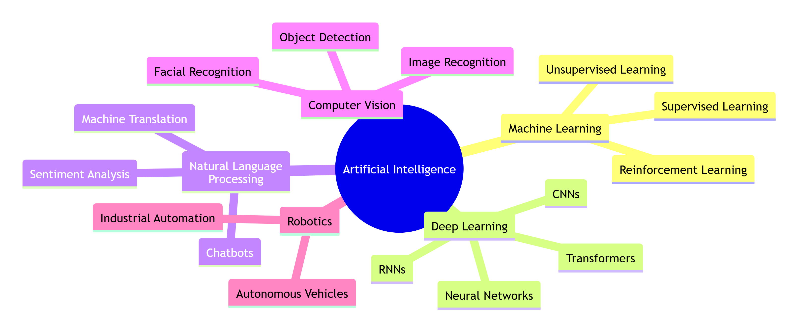

# Introduction to AI Concepts

A collaborative guide by **Allan, Mary, Francis, Sarah, Wambui, Simon and Peter**.

## Table of Contents
1. [Introduction](#introduction)
2. [Machine Learning](#machine-learning)
3. [Neural Networks](#neural-networks)
4. [Natural Language Processing (NLP)](#natural-language-processing-nlp)
5. [Convolutional Neural Networks (CNN)](#convolutional-neural-networks-cnn)
6. [Deep Learning](#deep-learning)
7. [Large Language Models (LLM)](#large-language-models-llm)

## Introduction (24/06/2024), edited 
From Netflix's personalized movies and shows to voice assistants such as Siri and Alexa, Artificial Intelligence (AI) seems to be revolutionizing the world around us. This is a co-created guide that facilitates the understanding of the three core concepts of AI which include,

*Figure 1: Overview of AI concepts covered in this guide*

At the completion of this guide, I should have a strong grasp of the fundamental concepts that are the backbone of the current wave of AI innovation.
## Machine Learning
Machine learning is a subset of artificial intelligence that enables computer systems to learn fron data and identify patterns autonomously. It is divided into supervised learning, unsupervised learning, semi-supervised learning and reinforcement learning. In fraud detection, banks use machine learning to scan millions of credit card transactions per second, instantly flagging unusual purchases to prevent fraud.

## Neural Networks

Neural networks are machine learning models inspired by the human brain.

### Components
- Input Layer
- Hidden Layer
- Output Layer

### Advantages
- Learns patterns
- Improves predictions
### Neural Networks and How They Work

Neural networks are a type of Artificial Intelligence (AI) inspired by the human brain. They help computers learn patterns and make decisions from data.

### A neural network has three main parts:

Input Layer – Receives information such as images, numbers, or text.
Hidden Layers – Processes the information by finding patterns and relationships.
Output Layer – Produces the final result or prediction.

### How neural networks work:

Data is entered into the input layer.
The hidden layers analyze the data using mathematical calculations.
The network makes a prediction.
The prediction is compared with the correct answer.
Errors are calculated and the network adjusts itself to improve accuracy.
This process repeats many times until performance improves.

### Example:
If a neural network is trained to recognize cats, it studies thousands of images and learns features like ears, eyes, and shapes until it can identify a cat correctly.

### Neural networks are used in:

Image recognition
Speech recognition
Chatbots
Recommendation systems
Self-driving cars
Medical diagnosis

Neural networks are a major part of machine learning and modern AI systems 
24/06/2026.
### Neural Network Structure

Input Layer
   ↓
Hidden Layer
   ↓
Output Layer

## Natural Language Processing (NLP)

Natural Language Processing (NLP) is a branch of Artificial Intelligence that enables
computers to understand, interpret, and generate human language in a meaningful way.
It sits at the intersection of linguistics, computer science, and machine learning.
### How NLP Works

NLP systems process text or speech through a pipeline of steps:

1. **Tokenization** – Breaking text into smaller units (words, sentences, or subwords).
2. **Part-of-Speech Tagging** – Identifying whether each word is a noun, verb, adjective, etc.
3. **Parsing** – Analysing the grammatical structure of sentences.
4. **Semantic Analysis** – Extracting the meaning behind the words.
5. **Pragmatic Analysis** – Understanding context and intent.

### Key NLP Tasks

- **Sentiment Analysis** – Determining whether text expresses positive, negative, or neutral emotion.
- **Machine Translation** – Automatically translating text between languages (e.g., Google Translate).
- **Named Entity Recognition (NER)** – Identifying names of people, places, and organisations in text.
- **Text Summarisation** – Condensing long documents into shorter summaries.
- **Question Answering** – Systems that respond to queries in natural language (e.g., chatbots).
- **Speech Recognition** – Converting spoken language into text.

### Popular NLP Tools & Libraries

| Library | Language | Use Case |
|---|---|---|
| NLTK | Python | Teaching & research |
| spaCy | Python | Production NLP pipelines |
| Hugging Face Transformers | Python | State-of-the-art models |
| Stanford NLP | Java/Python | Academic research |

## Example of a python code

name = input("What is your name? ")
print(f"Hello, {name}! Welcome to Python.")

### Real-World Applications

NLP powers many technologies we use daily:
- **Virtual assistants** like Siri, Alexa, and Google Assistant
- **Email spam filters** that classify unwanted messages
- **Grammar checkers** like Grammarly
- **Search engines** that understand query intent
- **AI chatbots** like Claude and ChatGPT

### Challenges in NLP

Human language is complex. NLP systems must grapple with:
- **Ambiguity** – "I saw the man with the telescope" (who has the telescope?)
- **Sarcasm & irony** – Hard to detect without context
- **Multilingualism** – Thousands of languages, many with limited training data
- **Evolving language** – Slang, neologisms, and cultural references change over time

### The Role of Transformers

Modern NLP is dominated by **transformer-based models** (introduced in the 2017 paper
*"Attention Is All You Need"*). Models like BERT, GPT, and T5 learn language patterns
from vast amounts of text, enabling remarkable performance across nearly all NLP tasks.

NLP is one of the fastest-moving fields in AI, with new breakthroughs emerging regularly —
making it an exciting area for both researchers and practitioners.

## Example of a simple Python code

name = input("What is your name? ")
print(f"Hello, {name}! Welcome to Python.")

## Convolutional Neural Networks
<!-- [Wambui] will write this section -->
## Convolutional Neural Networks 24/06/2026

Convolutional Neural Networks (CNNs) are a specialized type of artificial neural network designed to analyze visual data such as images and videos. Unlike traditional neural networks, CNNs automatically learn important features from images without requiring manual feature extraction. They use small filters (also called kernels) that scan across an image to detect patterns such as edges, corners, textures, shapes, and eventually complete objects.

A CNN is made up of several layers that work together to process image data:

Convolutional Layer: Applies filters to detect features like edges, lines, and textures.

Activation Layer (ReLU): Introduces non-linearity, allowing the network to learn complex patterns.

Pooling Layer: Reduces the size of feature maps while preserving important information, making computation faster and reducing overfitting.

Fully Connected Layer: Combines all extracted features to classify the image or make predictions.

Output Layer: Produces the final prediction, such as identifying the object in an image.

CNNs are highly effective because they can automatically recognize increasingly complex features as more layers are added. Early layers detect simple patterns, while deeper layers identify complete objects such as faces, vehicles, or animals.

### Advantages of CNNs

Automatically learn important image features without manual programming.

Achieve high accuracy in image classification and object detection.

Handle large image datasets efficiently.

Reduce the number of parameters compared to traditional neural networks through parameter sharing.

Can be trained for many different computer vision tasks.

### Limitations of CNNs

Require large amounts of labeled training data.

Training can be computationally expensive and often requires powerful GPUs.

Performance depends on the quality and diversity of the training dataset.

May struggle when images differ significantly from those seen during training.

### Key Uses of CNNs

1. Image Recognition: Identifying objects in photographs, such as people, animals, vehicles, and buildings. This technology is widely used in photo organization applications like Google Photos.

2. Medical Imaging: Detecting diseases such as cancer, pneumonia, fractures, and brain abnormalities from X-rays, CT scans, and MRI images, helping doctors make faster and more accurate diagnoses.

3. Facial Recognition: Used in smartphone face unlock systems, airport security, surveillance systems, and social media platforms for automatic photo tagging.

4. Self-Driving Cars: Detecting traffic signs, road lanes, pedestrians, cyclists, and other vehicles to enable safe autonomous driving.

5. Security and Surveillance: Monitoring public spaces, detecting suspicious activities, and identifying unauthorized individuals.

6. Agriculture: Identifying crop diseases, estimating crop yields, detecting pests, and monitoring plant health using drone or smartphone images.

7. Manufacturing: Inspecting products for defects during production, improving quality control while reducing human error.

8. Retail: Supporting automated checkout systems, inventory management, and customer behavior analysis.

### CNN Applications in Kenya

CNN technology has significant potential in Kenya across multiple sectors. Farmers can use smartphone applications to identify crop diseases affecting maize, coffee, tea, and tomatoes by simply taking photographs of infected plants. Healthcare facilities, especially in rural areas, can use CNN-powered diagnostic systems to analyze medical images where specialist doctors are scarce. Wildlife conservation organizations can apply CNNs to identify and track animals using camera traps, helping protect endangered species. Financial institutions can use CNNs to verify identity documents and improve biometric security systems. Additionally, traffic management authorities can use CNNs to monitor roads, detect congestion, and improve urban transportation systems. 

CNNs remain one of the most important technologies in modern artificial intelligence and computer vision. Their ability to automatically learn visual features has revolutionized industries such as healthcare, agriculture, transportation, manufacturing, security, and environmental conservation, making them an essential component of today's intelligent systems.

## Deep Learning
Deep learning is a branch of AI that teaches computers to learn patterns from data using structures called neural networks.
Basically,Deep learning teaches computers to learn from examples instead of being explicitly programmed.

### How Deep Learning Learns
Suppose we want to predict house prices.
Step 1: Feed data
Size → 1200
Bedrooms → 3
Location → Urban
↓
Prediction:$60,000
Actual:$75,000
Error:15,000
↓
The model adjusts itself.

↓

Repeats thousands of times.

This process is called:

Forward Propagation;Make prediction
Loss Function;Measure error
Backpropagation;Learn from error
Gradient Descent;Update weights

## Large Language Models

These are advanced computer programs designed to understand, process, and generate human language. They are trained on vast amounts of text data, enabling them to perform tasks such as answering questions, summarizing information, translating languages, and generating written content. LLMs are a subset of Artificial Intelligence (AI), specifically within the fields of Machine Learning (ML) and Natural Language Processing (NLP). They contribute to AI by allowing machines to communicate with humans in a natural and meaningful way.
Some common examples of Large Language Models include ChatGPT, Gemini, and Claude. ChatGPT, developed by OpenAI, is widely used for answering questions, assisting with learning, content creation, and programming support. Gemini, developed by Google, helps users with research, writing, problem-solving, and information retrieval. Claude, developed by Anthropic, is designed to assist with document analysis, customer service, and professional workplace tasks.
In real-life applications, LLMs are used in virtual assistants, customer support chatbots, educational platforms, language translation services, and content-generation tools. These applications help individuals and organizations improve productivity, access information quickly, and communicate more effectively.

